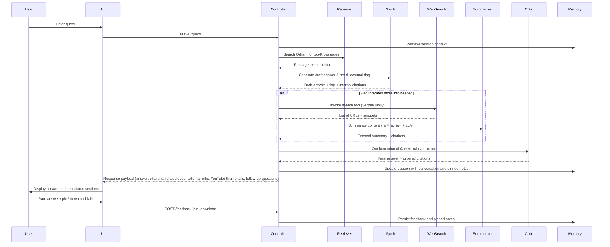

# Knowledge‑Base Agent – High‑Level Design

> **📍 Navigation Note**: This document provides the overall system architecture.
> For **detailed implementation specs**, see `.work-items/{feature-name}/design.md` (canonical source).
> For **current task breakdown**, see `.work-items/{feature-name}/task.md`.

---

## Introduction

The project aims to build a locally hosted knowledge‑base agent using the **LangChain** ecosystem, **Firecrawl** for web content extraction, and **Qdrant** as the vector store.  This agent ingests documents (PDF, Word, Markdown) and web links, stores them in a vector database, and allows users to ask free‑text questions via a simple HTML interface.  Answer generation follows a retrieval‑augmented pipeline: first consulting the internal corpus (**RAG for truth**) then supplementing missing information via web crawling/search (**CAG for intelligence**).  The system must cite sources, maintain conversational memory, and support features like pinning answers and downloading results as Markdown.  A `.env` file stores configuration variables, and the prototype runs locally with placeholders for authentication.  The final solution will deploy the backend as a separate service, optionally on Firebase or ECS, while keeping the UI static on Firebase Hosting.

The design follows the principles: **RAG for truth**, **CAG for intelligence**, **Memory for continuity**, **Agents for action**, and **Feedback loops for improvement**.

## Goals and Scope

1. **Data ingestion and indexing** – Users upload files (PDF, DOCX, Markdown) or provide URLs.  Ingestion services parse the content, chunk it, generate embeddings, and store them in Qdrant.  Firecrawl is used to fetch and parse web pages.  Uploaded files and crawled pages are saved as artifacts.
2. **Retrieval‑augmented answer generation** – For each query, the system performs vector similarity search on the internal corpus to retrieve top‑K passages.  An LLM synthesizer drafts an answer grounded solely in these passages (RAG).
3. **External search and synthesis** – When the internal corpus lacks sufficient information, the agent triggers external web retrieval via a web search provider (e.g., Tavily or a custom search API) and uses Firecrawl to extract content from result links.  Retrieved snippets are summarized and combined with the internal answer.
4. **Critical reasoning and citation** – A separate critic module evaluates and merges internal and external summaries, checks for consistency, and crafts a coherent response with clear citations to internal documents and external URLs.
5. **User interface** – A single‑page HTML application (white theme reminiscent of Google Search) provides:
   * a search bar for user queries;
   * an answer area with synthesized response and numbered citations;
   * sections listing internal documents and external resources used;
   * four YouTube thumbnails related to the query;
   * a “People with similar question also asked” section listing follow‑up questions generated by the LLM;
   * a pinning mechanism for answers, displayed as notes on the right;
   * a “Download as MD” button.
6. **Memory and continuity** – Session memory stores conversation history, pinned answers, and user preferences.  LangChain’s memory components or a custom session store persist context across requests.
7. **Feedback loop** – Users can rate answers.  Feedback is stored for offline evaluation to improve retrieval and synthesis quality.  Evaluation tools (e.g., RAGAS or LangChain evaluators) can be integrated later.
8. **Deployment** – The backend runs as a Python service built with FastAPI, LangChain, Firecrawl, and Qdrant.  The UI is served separately via Firebase Hosting.  Deployment to Firebase Functions, Cloud Run, or AWS ECS is possible; environment variables are loaded from `.env`.  Authentication placeholders are provided for future security integration.

## Architecture Overview

### Component Structure

```mermaid
flowchart TD
    subgraph Client
        A[HTML UI] -->|query| B
        A -->|feedback| FB
        A -->|pin download| P
    end
    subgraph Backend Service (FastAPI + LangChain)
        B[Query Controller] --> C1[RAG Retriever]
        C1 -->|top‑K passages| C2[Synthesizer]
        C2 -->|draft answer| C3[External Search Executor]
        C3 -->|web snippets| C4[External Summarizer]
        C4 -->|combined summary| CR[Critic]
        CR -->|final answer & citations| D
        FB[Feedback Controller] --> MEM[Session & Memory Service]
        MEM -->|session context| B
    end
    subgraph Data Services
        ING[Ingestion Service] --> VS[Qdrant Vector Store]
        ING --> ART[Artifact Store]
    end
    P[Pin/Download Handler] --> ART
    D --> A
```

**Descriptions**:

* **HTML UI** – Static web page served by Firebase Hosting.  It communicates with the backend via REST endpoints (`/query`, `/feedback`, `/pin`, `/download`).
* **Query Controller** – FastAPI endpoint that orchestrates the multi‑step retrieval and reasoning workflow.  It first calls the RAG Retriever, then the Synthesizer, and conditionally triggers external search and summarization before invoking the Critic.
* **RAG Retriever** – A LangChain `Tool` or custom function that queries Qdrant for the top‑K passages relevant to the query.  It returns passages with metadata (document ID, chunk index, score).
* **Synthesizer** – A LangChain `LLMChain` configured with a prompt template to generate an answer using only the retrieved internal passages.  It signals whether additional information is needed (e.g., by returning a flag).
* **External Search Executor** – A LangChain `Tool` wrapping a web search API (such as Tavily or Serper) that returns search results.  For each result, the service uses Firecrawl to fetch and parse the corresponding web page.
* **External Summarizer** – A LangChain `LLMChain` that condenses external snippets into structured facts with citations.
* **Critic** – A LangChain `LLMChain` responsible for combining internal and external summaries, resolving conflicts, and producing a final answer with ordered citations.  It applies critical reasoning to ensure factual consistency.
* **Feedback Controller & Session/Memory Service** – Modules to record user feedback and persist conversation context.  A simple in‑memory store or database (e.g., Redis or SQLite) retains session history, pinned notes, and preferences.
* **Ingestion Service** – An asynchronous service for parsing and chunking documents and web pages.  It uses file parsers for PDF, DOCX, and Markdown and Firecrawl for web pages.  Embeddings are generated via a sentence‑transformer model and stored in Qdrant along with metadata.  Raw documents are saved in an artifact store (e.g., local disk or cloud storage).
* **Qdrant Vector Store** – Persistent vector database used for similarity search over document embeddings.  For local development, a Docker‑hosted Qdrant instance is used.  In production, Qdrant Cloud or another managed vector store can be substituted.
* **Artifact Store** – File storage for raw documents and generated Markdown answers.  When deployed to Firebase, this maps to Cloud Storage.
* **Deployment** – The backend runs as a containerized FastAPI app.  Environment variables (e.g., model provider API keys, search API keys, Qdrant host URL, YouTube API key) are loaded from `.env`.  Authentication placeholders allow integration with Firebase Authentication or other IAM providers.

### Workflow Sequence



## Design Decisions and Justification

1. **LangChain as the agent framework** – Using LangChain and LangGraph provides a modular way to compose retrieval, summarization, and reasoning steps.  Unlike ADK, it is vendor‑neutral and compatible with many LLM providers and vector stores.  It also integrates readily with Qdrant and Firecrawl.
2. **Firecrawl for truth extraction** – Firecrawl fetches and parses entire web pages, ensuring that external information used in answers is grounded in actual content rather than search snippets alone.  This reduces hallucination risk.
3. **Qdrant vector store** – Qdrant offers efficient vector search with filtering and metadata.  It is open‑source, supports on‑premises and cloud deployment, and integrates with LangChain.
4. **LLM modularization (Synthesizer / Summarizer / Critic)** – Separating the reasoning process into specialized chains (RAG synthesizer, external summarizer, critic) enables more controllable and explainable behavior.  The critic ensures that information is consolidated and contradictions are resolved.
5. **Session memory** – Maintaining conversation context across queries allows follow‑up questions to reuse retrieved passages and to relate to previous answers.  LangChain memory components or a custom session store handle this state.
6. **Feedback loops** – Collecting user ratings provides a mechanism for offline evaluation and improvement.  Evaluation metrics such as faithfulness, relevance and succinctness can be computed using RAG scoring frameworks.
7. **Deployment decoupling** – Separating the front‑end (Firebase Hosting) and back‑end (FastAPI service) allows independent scaling and development.  The back‑end can run locally via Docker Compose or be deployed to Firebase Functions, Cloud Run, or AWS ECS without altering the agent logic.

## Future Work

* **Authentication and authorization** – Integrate authentication (Firebase Auth, OAuth) to protect endpoints.
* **Managed vector database** – Migrate from a local Qdrant instance to a managed vector database for scalability and fault tolerance.

## Spec‑Driven Development and Bootstrap

To make the project easier to extend and maintain with AI coding tools such as
Claude Code, the repository adopts a **spec‑driven development** workflow.
A `rules/` directory contains copies of the core process and standards
documents imported from the `genai‑specs` repository.  These files are
automatically loaded at the start of each coding session via a bootstrap
script (`scripts/claude-init.sh`) and a **pre‑prompt hook** registered in
`.claude/settings.json`【795882351538242†L17-L29】.  The project defines a
`.work-items/` folder for YAML cards that map user stories to specific code
targets and acceptance tests.  Additional hooks run before applying patches
and creating commits: the **pre‑patch hook** runs Vale and Markdownlint on
changed markdown files, and the **pre‑commit hook** runs the test suite.
These hooks are organized under `.claude/hooks/` and configured via the
settings file.  A set of Vale and Markdownlint configuration files enforce
documentation quality.  An evaluation harness (`evals/golden-queries.yaml`)
provides a corpus of representative queries against which nightly tests can
be run to detect regressions.  These additions improve reliability without
changing the core RAG pipeline.

* **Evaluation automation** – Incorporate automated evaluation pipelines using
  frameworks like RAGAS to benchmark retrieval quality and answer
  accuracy.
* **Observability** – Add tracing and logging (e.g., OpenTelemetry,
  LangSmith) to monitor latency, cost and failure rates.
* **Model hosting** – Swap the LLM provider (e.g., OpenAI, Anthropic,
  Google) based on cost, latency or accuracy.  The modular design allows
  replacing the model without altering the workflow.